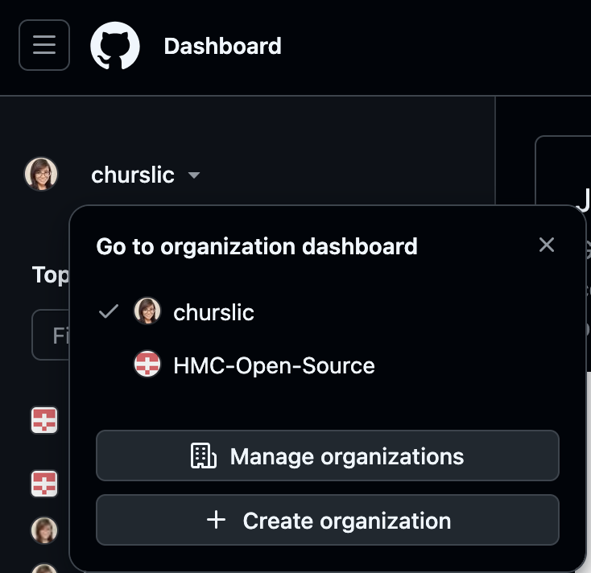

Use this when you're starting a brand new project and want git to start tracking it. You can 
also do this entirely through the GitHub interface if you prefer.

If you don't have a project readily available, create some simple "Hello, World" programs to
practice this. Make sure to practice this exercise on your own GitHub account!

[ACCORDION title="💡 How to switch between your personal account and the HMC Open Source org"]
Try this exercise out in your own personal. If you've never used GitHub Organizations, you can
find the opton in the top left-hand corner.



[/ACCORDION]


There are several ways to initialize git depending on whether:

- You have an existing project 
- There is an existing project on GitHub 
- You are about to start a project but your folder is empty or non-existent

For this section, we will focus on **you having an existing project** with files in them. These
steps should work for an empty project as well. 

**1. Create a new repo on GitHub.** Make your repo private if you think it would go against 
academic honesty. Or make your repo private if you're just testing with some dummy files. Do
NOT add a README.md file or any other extra files that GitHub prompts you with. 

**2. Navigate to your project folder in the terminal.**

```bash
cd your-project-folder-path
```

**3. Initialize git in your project folder.**

```bash
git init 
```

**4. Connect the local repo you just created in step 3 to GitHub**

```bash
git remote add origin SSH-URL
```

**5. Check the status of your files**. This is helpful to see which files have changed and are
ready to be committed. Since this is the first time initializing git, you'll see all files in
your folder highlighted in red. Use this command to help you remember where you made changes.

```bash
git status
```

**6. Stage your files.** This is like putting files on a workbench and saying they're ready to 
be committed. The `.` means all files in the current folder.

```bash
git add .
```

**7. Commit your files.** The `-m` flag lets you write the message inline. Make it descriptive 
enough to be useful, but keep it concise. For a first commit, you can always type in that it's
the initial commit.

```bash
git commit -m "initial commit"
```

**8. Push to GitHub!** The `-u` flag creates the tracking relationship between your local branch and the remote, so future pushes just need `git push`.

```bash
git push -u origin main
```

Now your GitHub repo is synced with your local files.

[QUIZ id="quiz-6a" hint="Think about what the -u flag does and when you only need it."]
Q: You've just created a new branch called fix-header and made your first commit. What command pushes this branch to GitHub for the first time?
- git push
- git push origin main
* git push -u origin fix-header
- git push --set-upstream fix-header origin
[/QUIZ]
